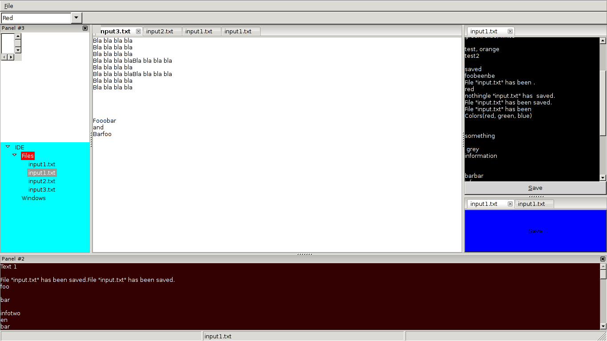

# Perl wxWidgets Reference App

This App demonstrates how to use wxPerl to build a typical IDE-like GUI
with the following features:

- menu with shortcuts
- multiple nested, resizable panes
- multiple, groupable, tabs
- reading from files/saving to files
- styling
- hierarchical tree view for files
- dialog windows

